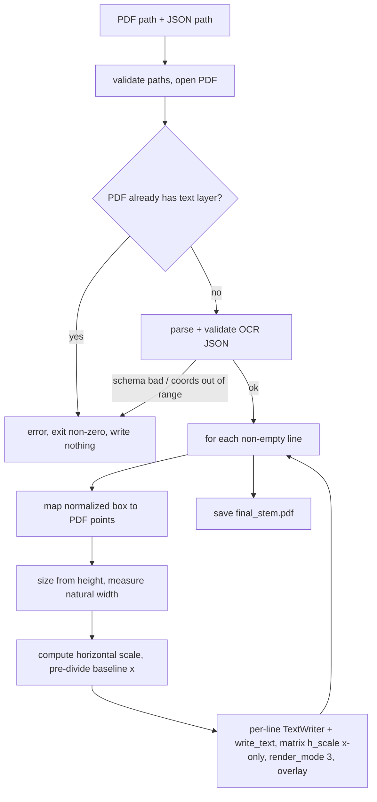

# feat: OCR Searchable-PDF Merge CLI

## Summary

Add a standalone CLI tool (`scripts/ocr_merge_cli.py`) that takes one image-only PDF page plus its OCR JSON and writes a `final_<stem>.pdf` carrying an invisible, searchable text layer whose selection tracks the printed words. It consumes existing Dynamics/Azure-style OCR results rather than running OCR itself, and mirrors the conventions of the existing `scripts/pdf_splitter_cli.py`.

---

## Problem Frame

Scanned document pages (e.g. `page_005.pdf`) are image-only: they cannot be searched and their text cannot be copied. OCR has already been run and saved as JSON beside each PDF, but the JSON lives separately, so the retrieval workflow gains nothing from it. A folder of scanned mill certificates is opaque to search — finding a heat number or PO across pages means opening and eyeballing each one. The OCR text and per-line coordinates already exist; they need to be married back onto the image so the page becomes searchable in place. See origin: `docs/brainstorms/2026-07-28-ocr-searchable-pdf-merge-requirements.md`.

---

## Key Technical Decisions

- KTD1. Invisible text via render mode 3, image untouched. Place OCR text with PyMuPDF's `render_mode=3` (emits the `3 Tr` operator, confirmed `src/__init__.py:15524`) so glyphs are selectable and searchable but paint nothing. Draw as an overlay (`overlay=True`) so the scanned image content stream is never modified. This is the standard "OCR sandwich."

- KTD2. Placement via per-line `TextWriter.write_text` with an anisotropic matrix. Each line needs its own horizontal scale (KTD3), and neither `TextWriter` seam can carry a per-line horizontal-only transform under a single emit: `TextWriter.append` (`src/__init__.py:16930`) hardcodes a uniform text matrix `fz_make_matrix(fontsize,0,0,fontsize,p.x,p.y)` (`src/__init__.py:16958`) with no transform parameter, and `write_text`'s `matrix` argument is emitted once as a page-global `cm` (`src/__init__.py:17349`) that scales all runs and both axes together. So place each line as its own `TextWriter` (one run) emitted with `write_text(page, matrix=Matrix(h_scale, 0, 0, 1, 0, 0), render_mode=3)` (`src/__init__.py:17254`), with the baseline x pre-divided by `h_scale` so the horizontal-only matrix scales width without shifting position. This means ~100 `write_text` calls (one content-stream insertion each) per page rather than a single emit — an accepted trade-off for correct per-line width-fit (see Risks).

- KTD3. Height-sizing plus horizontal scaling to fit box width. Size each line's font from its box height, then apply a horizontal scale so the run spans the box width. This keeps the selection band the correct height *and* makes it track the printed line. The scale is applied as an anisotropic transform (x scaled, y fixed) via the per-line `write_text` matrix (KTD2) — not by shrinking fontsize, which would distort glyph height and the selection band. Natural run width is measured with `Font.text_length` (`src/__init__.py:8502`); scale = `box_width / natural_width`, clamped to a sane range so near-empty lines don't explode. See origin Key Decisions.

- KTD4. Embed a Unicode-capable font. Use a `Font` constructed from a TTF with `embed=1` (`src/__init__.py:8281`) rather than base-14 `helv`, so German/accented OCR text (e.g. "Österreich") carries a correct `ToUnicode` map and copies/searches faithfully. `helv` would silently drop or mangle those glyphs — the exact text the tool exists to make searchable.

- KTD5. Coordinate conversion with no y-flip. The JSON's normalized (0–1) coordinates use a top-left origin, matching PyMuPDF's Python API. Convert with `x_pt = left * page.rect.width`, `y_pt = top * page.rect.height`; the baseline sits at box bottom (`(top + height) * page.rect.height`). No vertical flip is needed.

- KTD6. Strict on structure, tolerant of text. Fail loudly (exit non-zero, write nothing) only on structural anomalies: JSON unreadable or wrong schema, coordinates well outside 0–1, or the input PDF already carrying a real text layer. Garbled OCR text is placed verbatim; empty/whitespace lines are silently skipped. Text quality is never a failure trigger. See origin Key Decisions.

---

## Requirements

**Core behavior**

- R1. Given one image-only PDF and one OCR JSON, write a single `final_<input-stem>.pdf` in the input PDF's directory.
- R2. Output is visually identical to the input plus an invisible text layer (render mode 3); the image is unmodified.
- R3. Every non-empty OCR line is placed as one invisible run at its box, so text is searchable and copy/paste yields the line text.
- R4. Each placed line is height-sized and horizontally scaled to span its box width, so selection highlighting overlays the printed line.
- R5. Text is rendered with an embedded Unicode-capable font so non-ASCII characters are searchable and copy correctly.

**Input handling**

- R6. Read the Dynamics/Azure JSON shape: top-level array whose element carries a `lines` array; each line has `text` and a `boundingBox` with normalized `left`, `top`, `width`, `height`.
- R7. Convert normalized coordinates to PDF points against page dimensions, top-left origin, baseline at box bottom.
- R8. Empty or whitespace-only lines are silently skipped (not an error).
- R9. Garbled or misspelled OCR text is placed verbatim; text quality never fails or drops a line.

**Failure behavior**

- R10. On any structural anomaly, exit non-zero and write no output. Structural anomalies: JSON unreadable or not matching the expected schema; coordinates well outside 0–1; input PDF already containing a real text layer.
- R11. Error output names which structural condition failed, actionably for a human reviewing an automation failure.
- R12. Operate on exactly one PDF+JSON pair per invocation.

---

## High-Level Technical Design

Data flows from the two inputs through a pure mapping core into the invisible text layer:



The mapping core (steps F–H) is pure — normalized box + page rect + font → insertion point, fontsize, and horizontal scale — and is tested without any PDF. The schema parse (step D) is likewise pure JSON→line-records.

---

## Output Structure

```
scripts/
  ocr_merge_cli.py        # new: CLI entry point + orchestration
tests/
  test_ocr_merge_cli.py   # new: loads the CLI via importlib, tests pure + integration
```

The tool is a single module mirroring `scripts/pdf_splitter_cli.py`, not part of the built wheel. Internal structure (pure functions for schema parsing, coordinate mapping, and width-fit, plus the orchestration function) lives within `scripts/ocr_merge_cli.py`; the per-unit file lists remain authoritative.

---

## Implementation Units

### U1. OCR JSON schema adapter

- Goal: Parse the Dynamics/Azure `expando` JSON into a clean list of line records (`text` + normalized box), tolerating the `@odata.type` noise and rejecting structurally invalid input.
- Requirements: R6, R8, R9, R10 (schema + coord-range validation).
- Dependencies: none.
- Files: `scripts/ocr_merge_cli.py`, `tests/test_ocr_merge_cli.py`.
- Approach: A pure function takes parsed JSON and returns line records, each with `text` and `(left, top, width, height)`. Skip lines whose text is empty/whitespace. Raise a dedicated error type (mirroring `SplitterError`) when the top-level shape doesn't match (no array, no `lines`, missing `boundingBox` fields) or when any coordinate is well outside 0–1 (define a small tolerance, e.g. slightly negative rounding is fine, values like 5.0 are not). Garbled text passes through untouched.
- Patterns to follow: `SplitterError` and the validation style in `scripts/pdf_splitter_cli.py`.
- Test scenarios:
  - Covers R6. Given the real `page_005_formatted.json` shape, returns one record per non-empty line with correct text and box floats.
  - Covers R8. A line with empty or whitespace-only `text` is omitted from the records.
  - Covers R9. A garbled line ("Salte / page") is retained verbatim.
  - Covers R10. JSON that is not a top-level array, or an element with no `lines`, raises the schema error.
  - Covers R10. A `boundingBox` with a coordinate well outside 0–1 (e.g. `left: 5.0`) raises the error.
  - A line missing `boundingBox` keys raises the schema error rather than producing a partial record.
- Verification: schema-adapter tests pass; malformed inputs raise the dedicated error, valid input yields the expected record count.

### U2. Coordinate mapping and width-fit core

- Goal: Convert a normalized box plus page rect and font into an insertion point, fontsize, and horizontal scale factor — the pure geometry of placement.
- Requirements: R4, R7.
- Dependencies: none (independent of U1; composed in U3).
- Files: `scripts/ocr_merge_cli.py`, `tests/test_ocr_merge_cli.py`.
- Approach: A pure function takes `(box, page_width, page_height, text, font)` and returns `(baseline_point, fontsize, h_scale)`. Fontsize derives from `height * page_height` (optionally times a small factor for descender allowance). Natural run width = `font.text_length(text, fontsize=fontsize)`; `h_scale = (width * page_width) / natural_width`, clamped to a sane range (e.g. 0.1–10) so a one-character line in a wide box doesn't produce an absurd scale. Because the per-line matrix scales x by `h_scale` (KTD2), the returned baseline x is pre-divided: `baseline_point = ((left * page_width) / h_scale, (top + height) * page_height)`, so the matrix restores the intended left edge while scaling only width. No PDF is opened.
- Technical design (directional, not implementation spec): each line is emitted with its own `write_text(page, matrix=Matrix(h_scale, 0, 0, 1, 0, 0), render_mode=3)`. The anisotropic matrix scales x while leaving y (glyph height) fixed; the pre-divided baseline x cancels the matrix's effect on position so the run starts at the box's left edge. This function returns the numbers; U3 performs the emit.
- Patterns to follow: `get_text_length` (`src/__init__.py:22713`) and `Font.text_length` (`src/__init__.py:8502`) for width measurement.
- Test scenarios:
  - Covers R7. A box at `left=0, top=0` maps to baseline near the page top-left; a box at `top≈0.99` maps near the page bottom (baseline y ≈ page height).
  - Covers R7. Coordinates scale with page dimensions: doubling page width doubles the x point for the same normalized box.
  - Covers R4. A line whose natural width is half the box width yields `h_scale ≈ 2.0`; a line whose natural width exceeds the box yields `h_scale < 1.0`.
  - A degenerate near-zero-width box or single-character line clamps `h_scale` to the defined bounds rather than returning an extreme value.
- Verification: mapping tests pass with synthetic boxes; no PDF fixture required.

### U3. Invisible text-layer writer

- Goal: Given an open PDF page and the line records, place every line as an invisible, width-fitted run using an embedded Unicode font, leaving the image untouched.
- Requirements: R2, R3, R4, R5.
- Dependencies: U1 (records), U2 (placement math).
- Files: `scripts/ocr_merge_cli.py`, `tests/test_ocr_merge_cli.py`.
- Approach: Construct one embedded Unicode `Font` (from a TTF, `embed=1`) and reuse it across lines. For each record, compute `(baseline_point, fontsize, h_scale)` via U2, build a one-run `TextWriter` for the page rect, `append` the run at the pre-divided baseline with that fontsize, and emit with `write_text(page, matrix=Matrix(h_scale, 0, 0, 1, 0, 0), render_mode=3)` — one emit per line so each carries its own horizontal scale. Keep `overlay=True` so the image is preserved. (Per KTD2, a single accumulate-then-emit can't carry per-line horizontal scale.)
- Patterns to follow: `TextWriter` (`src/__init__.py:16905`), `TextWriter.append` (`16930`), `TextWriter.write_text` (`17254`, note the `matrix` argument); PyMuPDF OCR recipe (invisible text layer).
- Test scenarios:
  - Covers R3. After merging a small fixture, `page.get_text()` returns the placed line text and Ctrl+F-style search (`page.search_for`) finds a known phrase.
  - Covers R5. A line containing non-ASCII ("Österreich") round-trips through `page.get_text()` as the correct Unicode, not mojibake or dropped glyphs.
  - Covers R2. The output page's image (rendered pixmap) matches the input's within tolerance — the visible content is unchanged.
  - Covers R4. The bounding box of a placed line (from `page.get_text("words")`/rect) sits within tolerance of the source box's page-space rectangle.
  - Covers R2, R3. Placing ~100 lines from the real page-5 JSON succeeds and all non-empty lines are retrievable.
- Verification: text-layer tests pass; searchable text present, image unchanged, non-ASCII faithful.

### U4. CLI entry point and orchestration

- Goal: Wire U1–U3 into a CLI mirroring `pdf_splitter_cli.py`: parse args, validate inputs, detect a pre-existing text layer, run the merge, and enforce strict-on-structure failure with actionable errors.
- Requirements: R1, R10, R11, R12.
- Dependencies: U1, U2, U3.
- Files: `scripts/ocr_merge_cli.py`, `tests/test_ocr_merge_cli.py`.
- Approach: argparse with positional `input_pdf` and `input_json`, optional `--output-dir` (default: input PDF's directory), producing `final_<stem>.pdf`. Validate paths and PDF openability; reject password-protected and empty PDFs. Before placing text, detect a pre-existing text layer via `page.get_text("text").strip()` (non-empty → structural error). Catch the schema/coord errors from U1 and map them to non-zero exit with a message naming the condition. Write to a temp file then `os.replace` (atomic), matching the splitter. Single pair per run.
- Patterns to follow: `create_parser`, `main`, `_validate_paths`, temp-file-then-replace, and error-to-exit-code handling in `scripts/pdf_splitter_cli.py`.
- Test scenarios:
  - Covers R1, R12. Given a valid single PDF + JSON, writes `final_<stem>.pdf` in the expected directory and exits zero.
  - Covers R10, R11. A PDF that already has selectable text exits non-zero, writes no `final_*.pdf`, and the message states a text layer already exists.
  - Covers R10, R11. Unreadable/wrong-schema JSON exits non-zero with a schema message and writes nothing.
  - Covers R10. JSON with out-of-range coordinates exits non-zero and writes nothing.
  - A missing input file, non-PDF input, or password-protected PDF exits non-zero with a clear message.
  - Partial-failure safety: when the merge raises mid-way, no partial `final_*.pdf` is left (temp-file discipline).
- Verification: CLI tests pass; happy path writes output and exits zero, every structural anomaly exits non-zero writing nothing.

---

## Scope Boundaries

### Deferred for later

- Batch/folder mode. One pair per invocation; the caller loops. Auto-pairing across the observed naming variance (`page_001.json` vs `page_005_formatted.json`) belongs to a later batch mode.
- Per-word selection highlighting. The JSON has only line-level boxes; word positions would be inferred and unreliable on tabular rows. Revisit if line-level proves too coarse or word-level OCR becomes available.
- A text-quality gate (e.g. fail when >X% of lines empty). "Strict" covers structure only.
- A `--json` machine-readable result on stdout. The pipeline branches on exit code alone for now (chosen over the report option in origin).

### Outside this scope

- Running OCR. The tool consumes existing JSON; it never invokes Tesseract or `Pixmap.pdfocr_save()` (which would re-OCR and ignore the supplied JSON).
- Page skew / polygon correction. The `boundingBox` polygon and any page-skew angle are unused; boxes are treated as axis-aligned rectangles.
- Multi-page inputs. Inputs are assumed single-page.

### Deferred to Follow-Up Work

- None.

---

## Risks & Dependencies

- Depends on a Unicode-capable TTF being available to embed (KTD4). Which font to bundle or reference is an implementation detail settled in U3; if none is available at runtime the tool should fail with a clear message rather than silently falling back to `helv`.
- Per-line emit cost. Placing text as one `write_text` per line (KTD2) inserts ~100 content streams per page instead of one. This is the accepted cost of per-line horizontal scaling — the uniform-matrix seams can't express it under a single emit. If profiling on real batches shows this is too slow, the fallback is grouping lines that share an `h_scale` bucket into fewer emits; not needed unless measured.
- Text-layer detection via `page.get_text("text")` assumes a genuine OCR-target page is image-only (empty text). A page with incidental vector text would be treated as "already has a layer" and rejected — acceptable under strict-on-structure, and the error message makes the cause visible.

---

## Sources & Research

- Origin requirements: `docs/brainstorms/2026-07-28-ocr-searchable-pdf-merge-requirements.md`.
- Prior ideation: `docs/ideation/searchable-pdf-ocr-merge.html`.
- Tool to mirror: `scripts/pdf_splitter_cli.py`.
- OCR JSON sample and shape: `page_005_formatted.json` (Dynamics `expando`; 107 lines; normalized boxes; non-ASCII text).
- PyMuPDF APIs (`src/__init__.py`): render mode / `Tr` (`15524`), `TextWriter` (`16905`), `append` (`16930`), `write_text` (`17254`), `Font` (`8281`), `Font.text_length` (`8502`), `get_text_length` (`22713`).
- Technique: invisible-text "OCR sandwich" (render mode 3) with horizontal scaling to fit line width, as used by Tesseract / OCRmyPDF.
